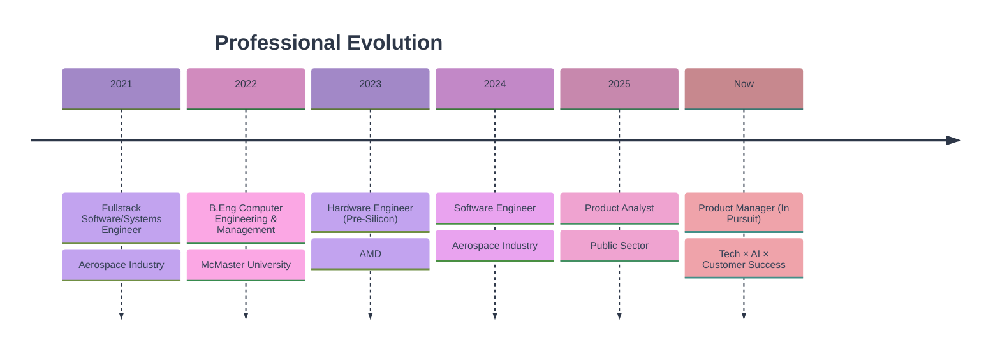

# Hi, I'm Jasleen Deol 👋

<div align="center">
  
  
  
  [](https://www.linkedin.com/in/jasleen-deol)
  [](mailto:jasleen.k.deol@gmail.com)
  [](https://drive.google.com/file/d/1z24Uncn0DqgzQFkIgkTTZXjIBGJwGaDm/view?usp=sharing)

</div>

---

## 🚀 About Me

```yaml
current_focus: Product Management + AI + Customer Success
mission: Transform user pain points into delightful product experiences
approach: Data-driven decisions + Human-centered design
```

### 📍 Career Journey



### 💡 When I'm Not Shipping Products

<table>
<tr>
<td width="25%" align="center">🏔️<br><b>Mountain Hiking</b></td>
<td width="25%" align="center">💃<br><b>Salsa Dancing</b></td>
<td width="25%" align="center">🎵<br><b>Music Teaching</b></td>
<td width="25%" align="center">👨‍💻<br><b>Vibe Coding</b></td>
</tr>
</table>

---

## 🎯 Product Portfolio

### 📊 Case Studies
> *Deep-dive analyses showcasing product thinking and market research*

<table>
<tr>
<td width="50%">

#### 🎓 [Boomerang Alumni B2C App](https://www.notion.so/Boomerang-Alumni-B2C-App-2658ec37e04480b794f2d4687b2aee1c?pvs=21)

**Focus:** Community engagement & alumni networking

**Key Skills:** Market research, user journey mapping, competitive analysis

</td>
<td width="50%">

#### 🤝 [Product Case Analysis: Includ](https://www.notion.so/Product-Case-Analysis-Includ-2418ec37e044801fb2a6e48673f1524f?pvs=21)

**Focus:** Inclusive product design

**Key Skills:** Accessibility research, stakeholder analysis

</td>
</tr>
</table>

---

### 🛠️ Product Demos
> *Interactive prototypes addressing real user problems*

#### 💼 [SimplyInsured - Health Insurance Made Simple](https://preview--simply-care-proto.lovable.app/)

<details>
<summary><b>🎯 Problem Statement</b></summary>
<br>

**Client Pain Points** (derived from BBB.org reviews):
- ⏰ Extended wait times for customer support
- 📞 Lack of proactive follow-up
- ⚠️ No notification system for policy changes/cancellations

**Solution Approach:**
- Real-time customer support dashboard
- Automated notification system
- Transparent policy management interface

**Tech Stack:** Lovable, Figma, React

</details>

---

#### 🎯 [Boomerang Pathways App](https://preview--boomerang-pathways-app.lovable.app/dashboard)

<details>
<summary><b>🎯 Product Context</b></summary>
<br>

**Background:** Created post-interview with Toronto-based startup based on insights from product designer about strategic direction

**Delivered:**
- Dashboard prototype aligned with business requirements
- Feature set informed by comprehensive case analysis
- Interactive demo showcasing product vision

**Tech Stack:** Lovable, React

</details>

---

#### 🎤 [Toastmasters AI Coach](https://www.figma.com/proto/as6PA96jKmy5fEWSjMm0zN/Toastmasters-Coach?node-id=1-2&t=MlNnxMR0nzXEOGul-1&starting-point-node-id=1%3A2)

<details>
<summary><b>🎯 Product Vision</b></summary>
<br>

**Concept:** Personal AI-powered public speaking coach

**Features:**
- 🎙️ Real-time speech analysis
- 📊 Performance metrics & insights
- 🤖 AI-driven coaching recommendations

**Tech Stack:** Python, React, TypeScript, PostgreSQL, OpenAI API, NLTK, Whisper

**Status:** 🚧 In Development

</details>

---

#### ❤️ [Connected Hearts](https://preview--spark-conversations-ai-crafted.lovable.app/)

<details>
<summary><b>🎯 Product Innovation</b></summary>
<br>

**Problem Solved:** Surface-level conversations limiting relationship depth

**Key Features:**
- 🎯 AI-curated conversation prompts
- 🎥 Simultaneous answer recording
- 🤝 Common ground analysis
- 📈 Progressive question difficulty

**Impact:** Helps couples deepen connections through meaningful dialogue

**Tech Stack:** Lovable, AI/ML integration

</details>

---

## 🛠️ Product Management Toolkit

<div align="center">

### Core Competencies


### Technical Skills


### Product Tools


</div>

---

## 📈 What Makes My Approach Different

```diff
+ Engineering background → Deep technical empathy with development teams
+ Hardware experience → Understanding of full product lifecycle
+ Aerospace industry → Rigorous approach to quality and safety
+ Public sector work → Focus on accessibility and inclusive design
+ UX strategy → User-centered thinking in every decision
```

---

## 📫 Let's Connect

<div align="center">

**Open to Product Management opportunities | Passionate about AI-powered solutions | Ready to ship products that matter**

[](https://www.linkedin.com/in/jasleen-deol)
[](mailto:jasleen.k.deol@gmail.com)
[](YOUR_PORTFOLIO_URL)

</div>

---

<div align="center">
  
</div>

<div align="center">
  
  *"Building products is not about the features you ship, but the problems you solve"*
  
</div>
